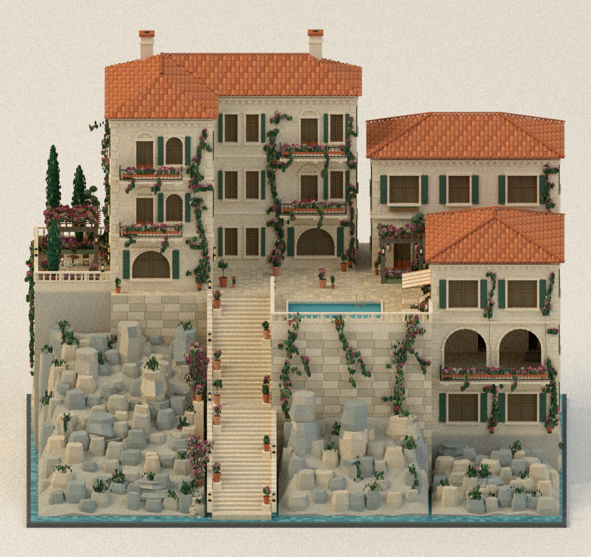

# Current hotel study

The latest review is [reference match v5](reference-match-v5/README.md), following the approved [layout v6](layout-v6/README.md) and [natural landscape v4](natural-landscape-v4/README.md).

Use the supplied [reference concept](reference-concept.png) and [decoration baseline](DECORATION_BASELINE.md) for every subsequent decoration review. The [comparison report](reference-match-v5/COMPARISON.md) records two iterations and an approximately 75% subjective visual assessment, including the differences that remain.

Ten pots now stand directly along the staircase edges on level supported pads. A continuous nine-stud centre remains clear within the original 14-stud stair width. Larger rose bushes, fuller pool-wall planting, ovate leaves, four arched window accents, stone tread details, smaller paving and sea tiles bring the appearance closer to the concept.

[Three-quarter view](reference-match-v5/blockout-concept.png) · [Staircase plan](reference-match-v5/plan-staircase.png) · [Pool](reference-match-v5/blockout-pool.png) · [Common garden](reference-match-v5/blockout-garden.png) · [Cottage garden](reference-match-v5/blockout-cottage.png) · [Dusk](reference-match-v5/blockout-dusk.png)

[Comparison](reference-match-v5/COMPARISON.md) · [Verification](reference-match-v5/verification.json) · [Download review bundle](../../../output/cliffside-hotel-reference-match-v5/Cliffside-Hotel-reference-review.zip)

All 57 modeled destinations remain reachable. Pot pads, full plant footprints and actual vegetation bounds preserve the stair centre. Deterministic export, eight rendered-image provenance checks, five plan sheets and refreshed donor evidence pass. The four window arches shape upper glazing corners; no door opening or room layout changes.

The larger approved building proportions, opaque glazing and simplified rock surfaces remain different from the concept. This remains architectural proxy geometry; actual LEGO quantities, connections, structural performance, physical assembly and LED wiring are unverified. Earlier revisions and the first comparison pass remain preserved.
