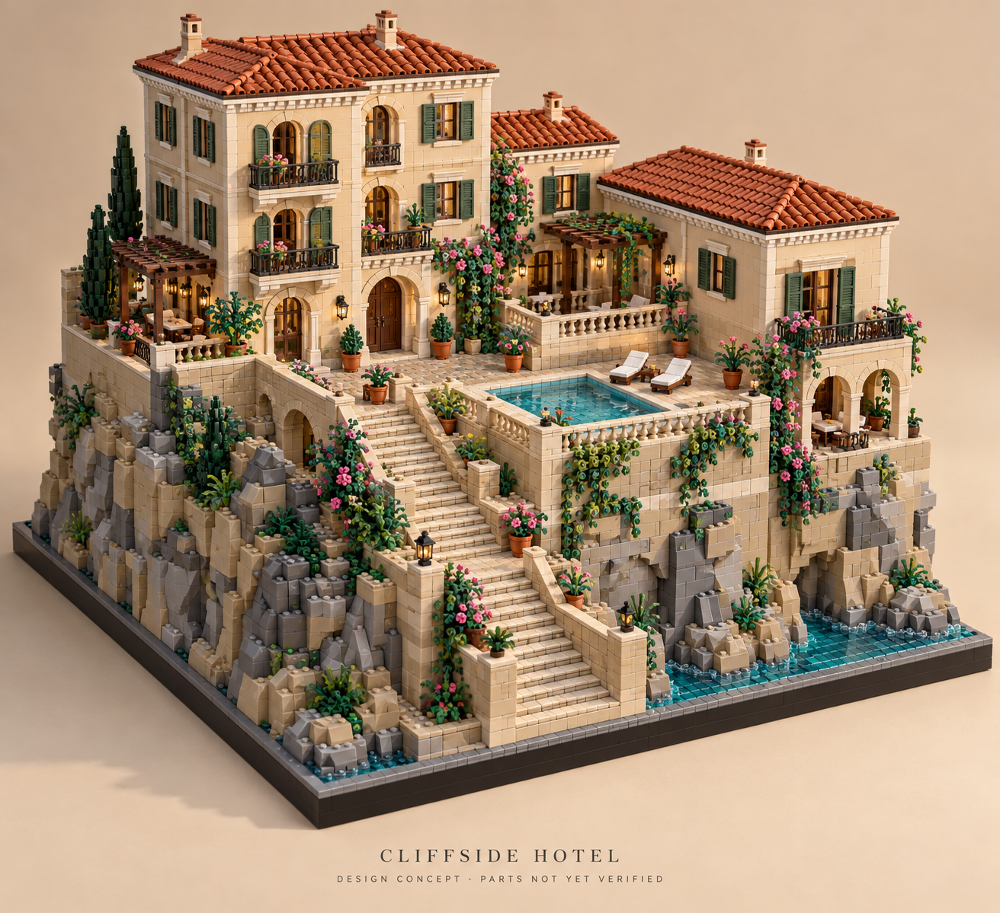
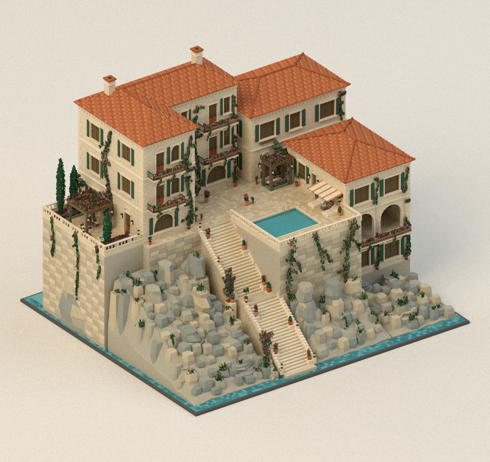

# Comparison with the supplied concept

**Final visual judgment: approximately 75% overall resemblance.** This is a subjective assessment after examining the actual front and three-quarter model renders against the supplied reference. It is not a calculated similarity percentage, a prediction of user approval, or a LEGO engineering score.

## Iterations

1. **Iteration 01 — approximately 65–70%.** Added ten staircase pots on supported edge pads, warm stone tread detail, angular rock fragments, smaller paving and blue sea tiles. Comparing both views showed that the landing planting was still too thin, the foliage looked sharply angular, and the main villa lacked the reference's arched window accents. Saved previews are in `iterations/01`.
2. **Iteration 02 — approximately 75%.** Broadened the rooted rose pockets beside the stairs, increased selected pool-wall foliage, replaced diamond leaves with ovate leaves, and added four arched stone window treatments. This is the model delivered in the parent folder. Its image hashes and source provenance are recorded alongside the renders.

## Visual assessment

| Area | Comparison with the concept |
|---|---|
| Staircase | Ten pots now stand directly along its edges, with varied planting, visible stone pads and larger flowering bushes beside the landings. Tread caps and nosings add the reference's masonry rhythm. A nine-stud centre is kept clear. |
| Planting | Creepers have rooted branches and uneven spread; denser roses mark selected landings and fuller foliage trails the pool wall. The reference still has finer, more varied leaf/flower elements. |
| Cliff | Angular fragments, connected outcrops, mixed stone colour and crevice vegetation replace the earlier column grid and rounded fragments. Large proxy facets remain smoother and coarser than the concept's individual LEGO-like rock pieces. |
| Architecture | Cream masonry, tiled roofs, shutters, balcony rails, arched windows and the service arcade provide the Mediterranean character. The approved L-shaped villa and enlarged two-storey cottage produce a broader, less compact silhouette than the original concept. |
| Terrace atmosphere | Garden seating, fountain, pergolas, pool shade, distributed pots, warmer glazing and daylight are present. The concept's visible furnished interiors and luminous glazing remain absent. |
| Water and material detail | Smaller pavers, tread joints and blue sea facets bring more surface variation. The reference still has more transparent water, sharper brick/stud detail and richer material reflections. |

The largest remaining differences are **building proportions, window/interior depth and fine LEGO surface detail**. The approved floor program has been retained rather than silently changing room sizes to reproduce the earlier concept silhouette.

## Front comparison requested by the user

| Supplied reference | Current front view |
|---|---|
|  |  |

## Closer camera-angle comparison

| Supplied reference | Current three-quarter view |
|---|---|
|  |  |

The front and reference images use different viewing angles. The second comparison helps distinguish camera effects from actual differences in geometry.
