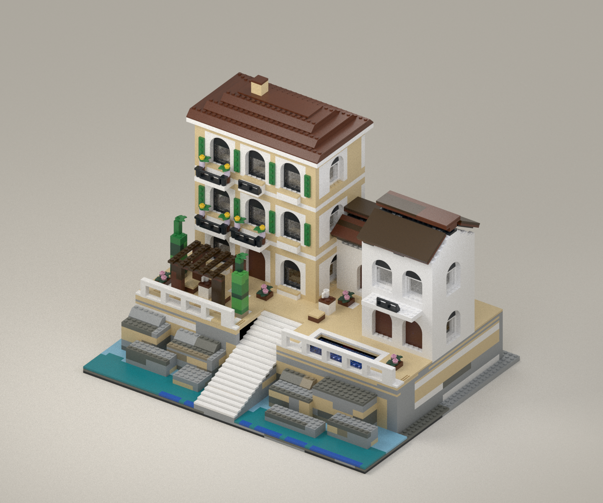

# Cliffside Hotel — architectural revision

This **2,648-piece visual review draft** replaces the rejected 2,188-piece
interpretation. Open `hotel.ldr` in BrickLink Studio to inspect the actual
parts and placements. `hotel-preview.png` and `hotel-preview-rear.png` render
that CAD file; they are not AI concept art.



The revised main building has three rows of genuine six-stud arches, recessed
windows, green shutters, thin black balcony rails and a continuous stepped
roof. A two-storey guest wing and lower connecting building surround the
pool terrace. The courtyard adds a timber pergola, tables, planters and a broad
staircase. Rear glazing prevents the buildings from becoming blank backdrops.
The foundation measures 56 × 44 studs (about 44.8 × 35.2 cm).

## Visual status

This is a review draft, not a claim that the approved concept has been matched.
The main building's arched openings, masonry spacing and balcony hierarchy are
closer to the reference. The roofs remain stepped/gabled approximations of its
curved terracotta roofs. The cliff is lower, more geometric and less detailed;
planting is also much sparser. The cream/tan main facade and white wings are
limited by the current exact-element allowances.

The source image is `reference-concept.png`. It is an aesthetic
reference with unverified parts and should not be used as a construction plan.
See `COMPARISON.md` for the remaining design differences.

## What is checked

- Exact-element usage fits the conservative donor allowances. All owned sets
  are eligible; the selected allocation is in `allocation.json`.
- The generated placements reproduce deterministically from the snapshot.
- Stud and mounting positions form one connected graph. Ordinary part bodies
  have no reported overlaps; insert and hinge transforms pass their checks.
- The geometry probe checks transformed LDraw bounds and nearby special-part
  mesh crossings. It excludes coplanar contact and full containment, so it is
  not a complete solid collision solver.
- Both render manifests identify the exact `hotel.ldr` hash they rendered.
- All 129 quantity overrides have been checked against the cited official
  instruction PDFs. Remaining allowances count one matching element per donor
  set copy; they are lower-bound estimates, not a physical stocktake.

These results assume complete, accessible donor sets and no other reservations.
Physical assembly, strength, clutch, construction access and a usable
instruction sequence have **not** been verified. In particular, the two smaller
roofs use hinged plates and need a real trial assembly before building.

## Files and reproduction

`bom.json` / `parts-list.csv` contain the combined demand. `allocation.json` /
`donor-picking-list.csv` identify which donor supplies each element quantity.
`model.json` retains every transform and exact element ID. LDraw stage markers
group work for inspection; they are not finished building instructions.

Run these from the repository root with the existing Python environment:

```sh
python data/mocs/cliffside-hotel-v2/hotel.py
python data/mocs/cliffside-hotel-v2/audit.py
python data/mocs/cliffside-hotel-v2/probe_geometry.py
python data/mocs/cliffside-hotel-v2/verify_revision.py --pdf-dir /private/tmp/hotel-roof-pdfs
```

Render with the existing `data/mocs/fern-and-steam-v2/render_model.py` Mitsuba
renderer after changing placements, before running the last check. See its
command-line help. Do not use the previously crashing Eyesight renderer.
Studio's installed LDraw library is required; the geometry probe also uses the
existing renderer library helper. PDF URLs and content hashes are recorded in
`verified-donor-quantities.json`. The PDFs themselves are not bundled.

`facade.py` generates a smaller architectural study inside `study/`. It does
not replace the full hotel's review files. `hotel.py` is the complete draft's
entry point. Existing rejected models and tracker data are preserved.
