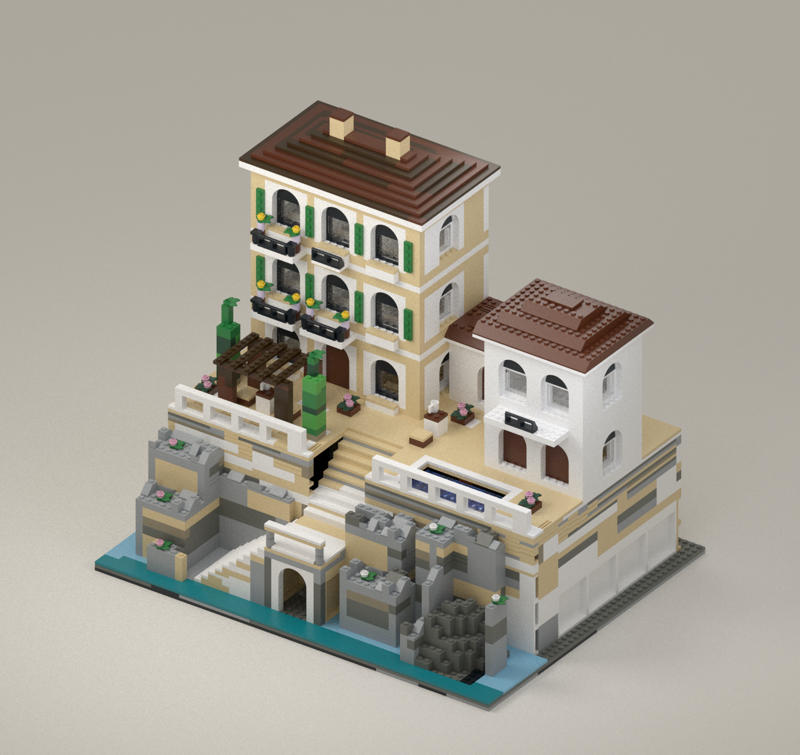

# Cliffside Hotel — refined coastal draft

**3,275 pieces; 56 × 44 studs.** This revision keeps the earlier arched hotel
architecture and concentrates on the roofs, cliff proportions and staircase.
The user approved prioritizing resemblance to the concept up to 3,500 pieces.



The terrace rises from 24 to 42 plates above the base. Two broad stair flights
turn at a landing with a real arched opening beneath it. Flowering ledges and
an owned 8 × 8 rock corner soften the cliff. Hollow rock shells have explicit
internal support columns where their ceiling patches require them.

All three roofs now use ordinary stud connections. The main roof has eight
thin hip courses and two chimneys; the smaller roofs use reddish-brown slopes.
The previous hinged roof panels have been removed. A lower rear gallery gives
the taller back elevation an architectural treatment while saving masonry.

## Review files

- `hotel.ldr`: editable actual-part CAD model for BrickLink Studio.
- `hotel-preview.png` and `hotel-preview-rear.png`: actual geometry renders.
- `parts-list.csv` / `bom.json`: demand by exact element ID and colour.
- `donor-picking-list.csv` / `allocation.json`: selected donor sources.
- `model.json`: every placement, orientation and exact element ID.
- `verification.json`, `geometry-verification.json`, `reproducibility.json`:
  scoped digital checks and artifact freshness.
- `reference-concept.png`: the approved AI concept, not build instructions.

The CAD model remains a visual review draft. Its roof courses approximate the
reference's curved terracotta tiles, and the stonework and planting remain
stylized. `COMPARISON.md` records those differences directly.

## Verification scope

Exact-element demand fits the current conservative inventory allowances.
These assume complete, accessible donor sets, correct cached membership and
no other reservations. All owned sets are eligible donors. The 129 sourced
quantity overrides are checked against the official PDFs identified by URL
and SHA-256 in `verified-donor-quantities.json`. Other quantities count one
matching element per donor copy, rather than assuming undocumented multiples.

The connection audit checks stud/mount alignment, ordinary body occupancy,
duplicates and transforms. The mesh probe checks recursively transformed
LDraw geometry, including the added slopes and rock panel. It excludes
coplanar contact and fully contained volumes and is not a complete solid
collision solver. Rock-panel ports use its eight corner base attachments and
five highest studs; other ledge studs are deliberately not assumed.

**Physical assembly, strength, clutch and construction access are untested.**
There is no finished instruction booklet. Stage markers group the CAD model
for inspection and are not a verified assembly sequence. Digital checks do
not establish physical strength or aesthetic equivalence to the AI image.

## Reproduction in the repository

```sh
python data/mocs/cliffside-hotel-v3/hotel.py
python data/mocs/cliffside-hotel-v3/audit.py
python data/mocs/cliffside-hotel-v3/probe_geometry.py
```

After rendering the front and rear from the new LDraw file, run:

```sh
python data/mocs/cliffside-hotel-v3/verify_revision.py --pdf-dir /private/tmp/hotel-roof-pdfs
```

The existing Mitsuba renderer is
`data/mocs/fern-and-steam-v2/render_model.py`; Studio's installed LDraw library
is required. The PDF cache is optional for artifact verification, but required
to repeat the source-page checks. The original PDFs are not bundled.

`baseline.py` and `facade.py` deterministically recover the preceding
architecture. `hotel.py` replaces its terrain and roofs, `site_refined.py`
authors the new site, and `roof_refined.py` / `roof_wings.py` author the roofs.
Earlier revisions and the tracker application's data are preserved.
