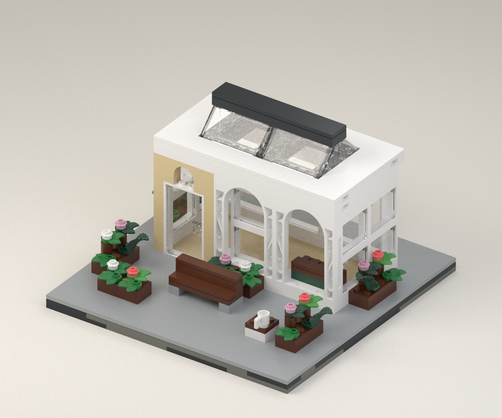

# Fern & Steam - Courtyard Edition

An original conservatory cafe made from exact elements listed in the owned
collection: **352 pieces, 56 element IDs, 24 x 24 studs**. The white arched
frontage, tan entrance, glass lantern roof, green counter, timber bench and
raised flower beds translate the approved concept into actual LEGO geometry.



## Open and review

- Open `fern-and-steam-v2.ldr` in BrickLink Studio. It contains 14 assembly
  stages and exact geometry/color references. Instance comments retain the
  collection's element IDs.
- `preview.png` and `rear.png` render that LDraw file with actual part meshes.
  `concept.png` is earlier AI concept art, not the model or a build reference.
- The coordinate-based digital build draft is at
  `../../../output/pdf/fern-and-steam-courtyard-build-draft.pdf`.
- `picking-list.md` lists the combined BOM and donor allocation.
  `placements.csv` provides every individual placement in a compact format.

This is a **digitally checked build draft, not a physically verified model**.
Use the editable model and guide for review and a trial assembly before
treating the design as finished instructions.

## What the checks establish

| Check | Result |
|---|---|
| Combined exact-element demand | All 352 pieces fit the conservative allowance |
| Ordinary brick/plate/tile body overlaps | None in the authored solid boxes |
| Stud attachment graph | One connected component |
| Duplicate placements / nominal mounting footprint | No errors |
| Compatible frame inserts, including actual transforms | 15 inserts pass |
| Recursive mesh body bottoms and regular footprints | 337 non-insert instances pass |
| Targeted accessory edge/triangle crossings | None among 54 nearby pairs |
| Physical build, loading, clutch strength and access | Not tested |
| Complete solid collision solver | Not run |

The accessory probe excludes coplanar contacts and is not a substitute for a
full solid collision test. The stud graph establishes alignment and continuity,
not strength. Arches, panes, windscreens and organic parts are deliberately not
treated as solid rectangular boxes. See the three JSON verification reports
and `REVIEW.md` for scope and resolved issues.

## Inventory rule

Count one copy of an exact element ID per owned donor-set copy; deduplicate
repeated rows within that set. This assumes complete, accessible donor sets,
correct cached membership and no other reservations. Actual quantities may
be higher. The snapshot excludes 40 rows with no element ID.

`allocation.json` assigns each required piece to a unique element/set/copy
combination. Under this deliberately conservative rule it uses 105 donor
boxes. That is not a claim that 105 boxes must be dismantled: counting repeated
pieces in a few donor sets may reduce that substantially. No tracker inventory
or reservation has been changed.

## Reproduce

Use Python 3.12 with `requirements.txt`. Authoring and the basic audit use the
standard library. Rendering and the geometry probe require the installed
Studio LDraw library; paths can be adjusted in the scripts. The renderer accepts
`--library` and includes one missing official primitive under `ldraw/`, with
source and license attribution.

```sh
python model.py
python audit.py
python probe_geometry.py
python -m unittest discover -p test_audit.py
python render_model.py --samples 256
python render_model.py --rear --output rear.png --samples 128 --width 1080 --height 900
python make_guide.py
```

Normal authoring runs use the frozen `inventory-snapshot.json`. Only run
`python model.py --refresh-inventory` when intentionally updating source
inventory/catalog data. `plant-layout.json` freezes the reviewed plant
positions and rotations, and authoring rejects a mismatched set of instances.
The generated LDraw, model, BOM, allocation and picking list are deterministic.
Render metadata captures the model hash, seed, settings and library hashes;
elapsed time in that metadata naturally varies.

The installed Eyesight and POV-Ray startup probes failed on missing shared
libraries. They are not used here; Mitsuba runs on the CPU. No installed
application files were modified.

## Construction details

- Install the counter before enclosing the facade and roof.
- Fit panes into frames before the cornice. The door uses Studio's canonical
  `60616a` representation; minor molding details can differ from actual stock.
- Each large arch has lower outer studs. Four white 1 x 1 fillers bring those
  studs to the common cornice level.
- The lantern has four fixed `92583` windscreens. Its lower rail beams form a
  subassembly tied by the eaves above; not every loose rail rests directly on
  the walls. Assemble and hold that module before attaching it to the cornice.
- Plant positions and rotations matter. The final arrangement avoids the
  surface crossings detected in an earlier dense arrangement.

The retained v1 is a superseded schematic prototype. Use this revision for
further development.
